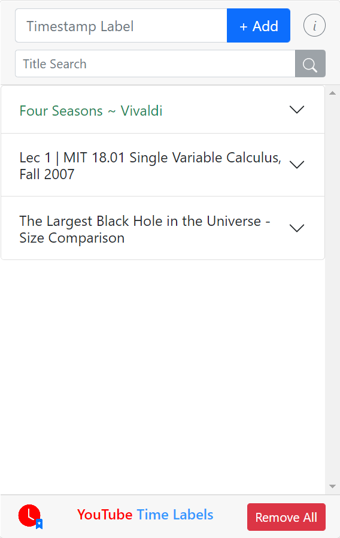
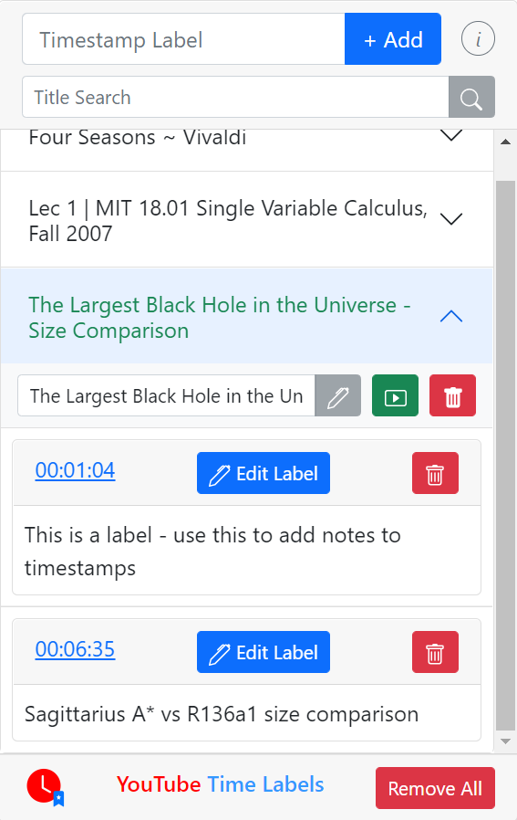

# Youtube Time Labels🕔🔖
This chrome extension allows a YouTube user to 'bookmark' different parts of a video so that they could come back to it later.

Each video can be expanded to show its timestamps. When you click on an added timestamp on the extension popup, the current tab is changed to the video, starting at the timestamp. You can add a custom label to each timestamp as notes or to remember the timestamp's contents. The title for each video can also be changed.

### Shortcut Keys
`CTRL+SHIFT+Q` (`⌘+⇧+E` on Macs): record current timestamp and add to extension.

## Project Details
The project is currently implemented using Javascript, Vue (with Vuex for centralized state management) and Bootstrap. It makes use of the Chrome Browser API for persistent storage, inter-service communication, and hotkeys.
Tools used in this project includes NPM and webpack.

### Organization
- `./dist/`: contains the installable chrome extension.
- `./src/`: source code that needs to be webpacked.
  - `./src/common/`: source code that is reused in multiple places.
  - `./src/components/`: Vue Single File Components.
  - `./src/store/`: Vuex centralized store definition and initialization.
- `./tests/`: contains unit tests for the project.
- `./scripts`: contains shell utility scripts.
- `./Changelog.md`: Lists history of versions.
- `./Plans.md`: Lists work-in-progress plans for upcoming release.
- `./componentHierarchy.txt`: Outlines how vue components are arranged in this project.

## Installation
To install the chrome extension to the browser *without* building, find the latest release on github: https://github.com/brianlinUM/youtube-timestamps/releases, and from assets download and unzip the `dist-v*.zip`. Then, enable *Developer Mode* in `chrome://extensions/`. "Load unpacked" from `dist-v*/`, which contains `manifest.json`.

If you have any Youtube tabs open, make sure to refresh them before using the extension.

## Building
Before beginning, make sure to have Node.js and NPM installed.

Install all Node dependencies by running from project root `/`:

`npm install`

Then, build the .js bundles by running one of:
- development build
  - `npm run dev`
- production build
  - `npm run prod`

This builds the source .js files to `dist/js/`.

## Testing
(Tests are currently broken)

This project currently uses `jest` for unit tests of non-vue js scripts, along with `jest-chrome` to mock Chrome's API.

Run by executing:

`npm run test`

Vue component tests and end-to-end tests are planned.

## Current Progress
See `changelog.md` for additional details, and `Plans.md` for ideas.
- **v0.1.0**: released April 3rd, 2021. This version focuses on basic functionality rather than UI / Aesthetics.
- **v0.1.1**: released April 4th, 2021. Fixes a content script issue.
- **v0.2.0**: released April 11th, 2021. Improves UI and supports custom labels for timestamps.
- **v0.2.1**: released May 6th, 2021. Fixes issue when adding timestamp if content script is not loaded.
- **v0.3.0**: Work in progress. Refactors popup instance (non-persistent) data store to Vuex for more maintainable code.
